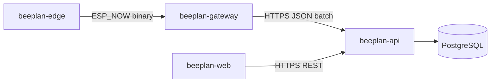

# BeePlan — архитектура

## Поток данных (MVP)

## Границы ответственности

| Компонент | Ответственность |
|-----------|-----------------|
| Edge | Сенсоры, признаки звука на устройстве, deep sleep, ESP‑NOW TX |
| Gateway | ESP‑NOW RX, очередь при обрыве сети, uplink на API |
| API | Аутентификация, доменная модель, хранение телеметрии, OpenAPI |
| Web | Отображение рядов, управление сущностями (пасека, семья, привязка устройства) |

## Версионирование

- REST: префикс `/v1`.
- Протокол ESP‑NOW: поле `proto_version` в заголовке пакета (см. README прошивок в **beeplan-edge** и **beeplan-gateway**).

## Развёртывание (разработка)

- `beeplan-api/docker-compose.yml` поднимает PostgreSQL и API.
- Web: переменная `VITE_API_URL` указывает на базовый URL API (например `http://localhost:8000`).

## Будущее

- TimescaleDB для `telemetry_samples` при росте объёма.
- Очередь (Redis/RabbitMQ) для асинхронной обработки аудио/ML — только когда появится серверный анализ.
