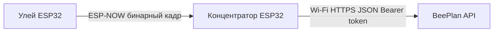

# Сборка железа и связь устройств BeePlan

**Важно для разработчиков:** при изменении схемы подключения датчиков, пинов, режимов питания, транспорта (ESP‑NOW / Wi‑Fi) или шагов настройки — **обновите этот файл в том же коммите**, чтобы пользовательские инструкции не расходились с прошивкой.

См. также: [ARCHITECTURE.md](ARCHITECTURE.md), [REQUIREMENTS.md](REQUIREMENTS.md).

---

## Общие сведения

| Прошивка | Репозиторий | Платы (PlatformIO / веб-мастер) |
|----------|-------------|----------------------------------|
| Конечное устройство (улей) | [beeplan-edge](https://github.com/4sidora/beeplan-edge) | `esp32dev` (ESP32), `esp32c3` (ESP32-C3) |
| Концентратор | [beeplan-gateway](https://github.com/4sidora/beeplan-gateway) | `esp32dev` (ESP32), `esp32c3` (ESP32-C3) |

В веб-мастере (`/install/gateway`, `/install/edge`) выберите плату по **чипу**. ESP32-C3: env `esp32c3`, плата DevKitM-1 в `platformio.ini`. Сборка: `pio run -e esp32dev` или `pio run -e esp32c3`.

### Serial Monitor на ESP32-C3

**Два типа плат:**

| Тип | Чип USB | В веб-мастере | Куда идёт `Serial` |
|-----|---------|---------------|-------------------|
| CORE-ESP32-C3, модули с **CH343/CH340** | USB-UART мост | **ESP32-C3 (CH343 / CH340…)** | UART0 GPIO20/21 → COM-порт |
| Super Mini с **нативным USB** на чипе | без моста | **ESP32-C3 (нативный USB…)** | USB CDC |

У **CORE-ESP32-C3** (CH343P) лог **не** идёт через USB CDC чипа — только через мост на **COM4**. Раньше при `ARDUINO_USB_CDC_ON_BOOT=1` монитор был пустым при рабочей прошивке.

**Serial port busy в Arduino IDE:** закройте вкладку прошивки в браузере (WebSerial держит COM4), подождите 2–3 с, затем откройте монитор.

В env `esp32c3` включён `ARDUINO_USB_CDC_ON_BOOT=0`. Если прошивали **до** этого исправления — соберите и прошейте заново через веб-мастер.

После прошивки:

1. **Закройте** вкладку с WebSerial (браузер держит COM-порт).
2. Откройте Serial Monitor: **115200**, 8N1 (PlatformIO, Arduino IDE, PuTTY).
3. Нажмите **RESET** на плате — через ~2 с должно появиться `BeePlan edge starting` или `BeePlan gateway starting`.
4. Edge пишет `edge wake cycle` раз в `WAKE_INTERVAL_SEC` (по умолчанию **600 с** = 10 мин) — это нормально, не «зависание».

**Светодиоды CORE-ESP32-C3:** D4 = GPIO12, D5 = GPIO13 (active HIGH). Прошивка мигает ими в рабочем цикле; быстрое мигание — ошибка ESP-NOW.

**Flash:** для CORE-ESP32-C3 обязателен режим **DIO** (QIO не подходит) — в `platformio.ini`: `board_build.flash_mode = dio`.

На Windows COM-порт после прошивки может сменить номер — проверьте Диспетчер устройств.

**Два COM-порта:** у ESP32-C3 часто появляются *USB JTAG/serial debug unit* и *USB Serial Device* — попробуйте **оба** на 115200. Закройте WebSerial перед открытием монитора.

**PlatformIO / Arduino IDE:** для C3 отключите DTR/RTS (`monitor_dtr = 0`, `monitor_rts = 0` в `platformio.ini`) — иначе монитор может сбрасывать плату в цикле и лог не виден.

**Светодиод GPIO8:** если прошивка работает, встроенный LED на многих C3 mini **мигает** раз в ~10 мин (цикл edge) или быстро при ошибке ESP-NOW. **Постоянно горит** — возможны boot loop (старая прошивка с `abort()`) или открыт не тот COM-порт.

---

## Прошивка через веб (рекомендуется)

1. В **beeplan-web** создайте пасеку, концентратор и (опционально) семью.
2. **Прошивка → Концентратор:** укажите Wi‑Fi и URL API (`VITE_DEVICE_API_URL` / LAN-IP сервера).
3. Дождитесь сборки на **beeplan-builder**, прошейте ESP32 через USB (WebSerial).
4. После boot gateway отправит `POST /v1/concentrators/heartbeat` — MAC появится в API.
5. **Прошивка → Улей:** зарегистрируйте edge-устройство, соберите и прошейте второй ESP32.

Конфигурация генерируется из `include/config.h.in` на сервере сборки; секреты Wi‑Fi **не сохраняются** в PostgreSQL.

Сервис сборки: [beeplan-builder](../beeplan-builder/README.md).

---

## Конечное устройство (`beeplan-edge`)

В веб-мастере (`/devices/install/edge`) выбирается **тип** устройства. Сейчас в продакшене — **мультидатчик**; **пасечные весы** в разработке.

### Мультидатчик (основной тип)

- **Установка:** устройство кладут **внутрь гнезда** в улей. Корпус — компактная автономная «коробочка» на ESP32.
- **Подключения:** к мультидатчику **не подключают** внешние датчики (ни весы, ни термодатчики снаружи). Температура, влажность и микрофон — **встроенные** в плату/корпус.
- **Связь:** ESP‑NOW на базовую станцию по MAC из API; Wi‑Fi AP на улье не нужен.
- **Телеметрия в API:** `temperature_c`, `relative_humidity`, `audio_features` (см. [REQUIREMENTS.md](REQUIREMENTS.md)).

### Пасечные весы (план)

Отдельный тип устройства для взвешивания; прошивка и мастер сборки — позже.

### Состояние прошивки (актуализировать при доработках)

Сейчас в коде **нет чтения реальных датчиков**: в кадр телеметрии подставляются **тестовые значения**. Таблица пинов ниже отражает **целевую** обвязку по продуктовым требованиям; как только в репозитории появится инициализация GPIO/I2C/SPI/ADC, **таблицу нужно привести в соответствие с исходниками** (имена констант пинов, файлы `config.h` и т.п.).

### Целевые датчики и пины (черновик)

| Датчик / узел | Назначение | Пин ESP32 (черновик) | Примечание |
|---------------|------------|----------------------|------------|
| Встроенный модуль | Температура / влажность | *TBD* | На плате мультидатчика внутри корпуса; не внешний провод к улью |
| MAX9814 (или аналог) | Акустика → АЦП | *TBD* | Встроенный микрофон; выход на **ADC1** (GPIO 32–39 на многих ESP32) |
| Питание | 3.3 V / GND | 3V3, GND | Согласовать с микрофонным модулем и датчиками |
| Deep sleep | RTC GPIO / кнопка | *TBD* | После внедрения пробуждения по таймеру или GPIO — указать фактическую схему |

Пока поля **TBD**: для отладки радиоканала достаточно ESP32 без внешней обвязки — у мультидатчика внешние датчики всё равно не предусмотрены.

### Сборка и прошивка (ручная)

1. Скопируйте `include/config.h.example` → `include/config.h`.
2. Задайте **`GATEWAY_MAC`** и **`DEVICE_PUBLIC_ID`** (или используйте веб-мастер `/install/edge`).
3. `pio run -t upload` из репозитория **beeplan-edge**.

Формат радиокадра — в [README beeplan-edge](https://github.com/4sidora/beeplan-edge/blob/main/README.md).

---

## Концентратор (`beeplan-gateway`)

### Состояние прошивки

В MVP концентратор **не использует внешние датчики**: только ESP32, Wi‑Fi (uplink в API) и приём **ESP‑NOW** от ульёв.

### Обвязка (минимум)

| Узел | Назначение | Примечание |
|------|------------|------------|
| ESP32 | Приём ESP‑NOW, HTTP-клиент | Антенна: штатная на модуле; при дальности — учитывайте расположение относительно ульёв |
| Питание | USB 5 V → регулятор на плате | Для поля — свой стабилизированный источник по документации платы |
| GSM (будущее) | Uplink без Wi‑Fi | В [REQUIREMENTS.md](REQUIREMENTS.md); после включения в сборку — дописать сюда модуль, UART и пины |

### Сборка и прошивка (ручная)

1. Скопируйте `include/config.h.example` → `include/config.h`.
2. Задайте Wi‑Fi, `API_BASE_URL`, `INGEST_TOKEN` (или веб-мастер `/install/gateway`).
3. `pio run -t upload` из репозитория **beeplan-gateway**.
4. MAC регистрируется автоматически через heartbeat; при ручной прошивке MAC виден в Serial и админке роутера.

---

## Как устройства соединяются между собой и с облаком

1. **В облаке (API):** у пасеки есть концентратор с секретом `ingest_token`; у концентратора зарегистрированы конечные устройства с полем **`public_id`** (совпадает с `DEVICE_PUBLIC_ID` в прошивке улья).
2. **По радио:** улей шлёт ESP‑NOW **на MAC концентратора** (пир задаётся в прошивке). Концентратор **не добавляет** ульи в список пиров — он принимает кадры с корректным заголовком протокола.
3. **Канал Wi‑Fi:** концентратор в сети роутера принимает ESP‑NOW **только на канале Wi‑Fi роутера** (в Serial: `WiFi channel=N`). Улей без Wi‑Fi должен слать на **тот же канал** — в новых прошивках edge делает авто-поиск каналов 1–13 при старте. Если в логе улья нет `ESP-NOW send status=0` или на концентраторе нет `ESP-NOW rx id=...` — перепрошейте **оба** модуля и проверьте, что в edge прошит MAC концентратора `A0:A3:B3:...` из heartbeat.
4. **В интернет:** концентратор вызывает `POST /v1/telemetry/batch` (раз в ~12 с при наличии данных) и `POST /v1/concentrators/heartbeat` при старте. В Serial концентратора должны появляться строки `ESP-NOW rx` и `POST /v1/telemetry/batch -> 200`.

### Диагностика: heartbeat есть, телеметрии нет

| Симптом | Что проверить |
|---------|----------------|
| Улей: `esp_now_send() rejected`, `channel=0`, `auto channel failed` | Часто **Wi‑Fi выключен** в edge: `WiFi.disconnect(true, …)` гасит радио — в прошивке должно быть `disconnect(false, true)`. Перепрошить edge; концентратор включён и в логе есть `WiFi channel=N` |
| В БД влажности много, температуры мало | Старая прошивка gateway теряла второй ESP-NOW пакет; перепрошить **gateway** (очередь приёма) и edge |
| Улей: только `edge wake cycle`, нет `ESP-NOW send status=0` | Канал Wi‑Fi / MAC gateway в прошивке; перепрошить edge после heartbeat концентратора |
| Концентратор: нет `ESP-NOW rx` | Расстояние, питание, разные каналы; в логе gateway смотрите `WiFi channel=` |
| Концентратор: есть `ESP-NOW rx`, нет `telemetry/batch` | Wi‑Fi упал после boot; `API_BASE_URL` не `localhost` с точки зрения ESP |
| `telemetry/batch -> 4xx` | Неверный `ingest_token` или `device_public_id` не совпадает с API (`edge-ad6304a0` и т.д.) |

Отдельного протокола «сопряжения по кнопке» в текущем MVP нет: связка **MAC концентратора + `public_id` улья + токен в шлюзе** задаётся конфигурацией до выезда на пасеку.

---

## Чеклист при изменении функционала

- [ ] Обновлена таблица пинов / датчиков для `beeplan-edge`.
- [ ] Обновлено описание обвязки концентратора (новые модули, UART, питание).
- [ ] Проверены шаги настройки `config.h` и ссылки на API/seed.
- [ ] При смене протокола или эндпоинта — блок «соединяются между собой» и ссылка на README прошивок.
