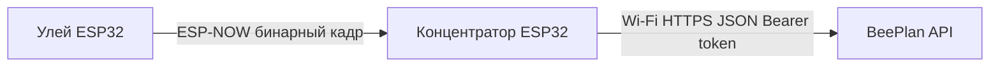

# Сборка железа и связь устройств BeePlan

**Важно для разработчиков:** при изменении схемы подключения датчиков, пинов, режимов питания, транспорта (ESP‑NOW / Wi‑Fi) или шагов настройки — **обновите этот файл в том же коммите**, чтобы пользовательские инструкции не расходились с прошивкой.

См. также: [ARCHITECTURE.md](ARCHITECTURE.md), [REQUIREMENTS.md](REQUIREMENTS.md).

---

## Общие сведения

| Прошивка | Репозиторий | Плата по умолчанию (PlatformIO) |
|----------|-------------|----------------------------------|
| Конечное устройство (улей) | [beeplan-edge](https://github.com/beeplan/beeplan-edge) | `esp32dev` (ESP32) |
| Концентратор | [beeplan-gateway](https://github.com/beeplan/beeplan-gateway) | `esp32dev` (ESP32) |

Можно собирать под другую плату с ESP32 — укажите `board` в `platformio.ini` и сверьте нумерацию GPIO с даташитом **вашей** платы.

---

## Конечное устройство (`beeplan-edge`)

### Состояние прошивки (актуализировать при доработках)

Сейчас в коде **нет чтения реальных датчиков**: в кадр телеметрии подставляются **тестовые значения**. Таблица пинов ниже отражает **целевую** обвязку по продуктовым требованиям; как только в репозитории появится инициализация GPIO/I2C/SPI/ADC, **таблицу нужно привести в соответствие с исходниками** (имена констант пинов, файлы `config.h` и т.п.).

### Целевые датчики и пины (черновик)

| Датчик / узел | Назначение | Пин ESP32 (черновик) | Примечание |
|---------------|------------|----------------------|------------|
| — | Температура / влажность | *TBD* | В [REQUIREMENTS.md](REQUIREMENTS.md): отдельный датчик или модуль; часто I2C (например SDA/SCL — задать при выборе чипа) |
| MAX9814 (или аналог) | Акустика → АЦП | *TBD* | Выход на **ADC1** (на многих ESP32 GPIO 32–39); избегать конфликта с Wi‑Fi при одновременной работе |
| Питание | 3.3 V / GND | 3V3, GND | Согласовать с микрофонным модулем и датчиками |
| Deep sleep | RTC GPIO / кнопка | *TBD* | После внедрения пробуждения по таймеру или GPIO — указать фактическую схему |

Пока поля **TBD**: пользователь собирает только ESP32 для отладки радиоканала; датчики можно не подключать.

### Сборка и прошивка

1. Установите [PlatformIO](https://platformio.org/).
2. В `beeplan-edge/include/config.h` задайте:
   - **`GATEWAY_MAC`** — MAC-адрес ESP32 концентратора (режим STA, см. раздел про концентратор).
   - **`DEVICE_PUBLIC_ID`** — строка, как у записи **EdgeDevice** в BeePlan API (например после `seed_dev`: `dev-edge-1`).
3. `pio run -t upload` из клонированного репозитория **beeplan-edge**.

Формат радиокадра — в [README beeplan-edge](https://github.com/beeplan/beeplan-edge/blob/main/README.md) (при другом org замените префикс в ссылке).

---

## Концентратор (`beeplan-gateway`)

### Состояние прошивки

В MVP концентратор **не использует внешние датчики**: только ESP32, Wi‑Fi (uplink в API) и приём **ESP‑NOW** от ульёв.

### Обвязка (минимум)

| Узел | Назначение | Примечание |
|------|------------|------------|
| ESP32 | Приём ESP‑NOW, HTTP-клиент | Антенна: штатная на модуле; при дальности — учитывайте расположение относительно ульёв |
| Питание | USB 5 V → регулятор на плате | Для поля — свой стабилизированный источник по документации платы |
| GSM (будущее) | Uplink без Wi‑Fi | В [REQUIREMENTS.md](REQUIREMENTS.md); после включения в сборку — дописать сюда модуль, UART и пины |

### Сборка и прошивка

1. В `beeplan-gateway/include/config.h` задайте **`WIFI_SSID`**, **`WIFI_PASSWORD`**, **`API_BASE_URL`**, **`INGEST_TOKEN`** (токен концентратора из API, см. `python -m beeplan.seed_dev` в [README beeplan-api](https://github.com/beeplan/beeplan-api/blob/main/README.md)).
2. `pio run -t upload` из репозитория **beeplan-gateway**.
3. Узнайте **MAC станции** этого ESP32 (лог при старте, веб-интерфейс роутера, `WiFi.macAddress()` в тестовом скетче) и пропишите его в **`GATEWAY_MAC`** на каждом конечном устройстве.

---

## Как устройства соединяются между собой и с облаком

1. **В облаке (API):** у пасеки есть концентратор с секретом `ingest_token`; у концентратора зарегистрированы конечные устройства с полем **`public_id`** (совпадает с `DEVICE_PUBLIC_ID` в прошивке улья).
2. **По радио:** улей шлёт ESP‑NOW **на MAC концентратора** (пир задаётся в прошивке). Концентратор **не добавляет** ульи в список пиров — он принимает кадры с корректным заголовком протокола.
3. **Канал Wi‑Fi:** для стабильности ESP‑NOW оба ESP32 должны работать в совместимой конфигурации канала (при появлении сбоев сверьтесь с документацией ESP‑NOW для вашей связки «улей без постоянного Wi‑Fi / концентратор в сети роутера» и при необходимости зафиксируйте здесь рекомендуемую схему).
4. **В интернет:** только концентратор подключается к Wi‑Fi и вызывает `POST /v1/telemetry/batch` с заголовком `Authorization: Bearer <ingest_token>`.

Отдельного протокола «сопряжения по кнопке» в текущем MVP нет: связка **MAC концентратора + `public_id` улья + токен в шлюзе** задаётся конфигурацией до выезда на пасеку.

---

## Чеклист при изменении функционала

- [ ] Обновлена таблица пинов / датчиков для `beeplan-edge`.
- [ ] Обновлено описание обвязки концентратора (новые модули, UART, питание).
- [ ] Проверены шаги настройки `config.h` и ссылки на API/seed.
- [ ] При смене протокола или эндпоинта — блок «соединяются между собой» и ссылка на README прошивок.
