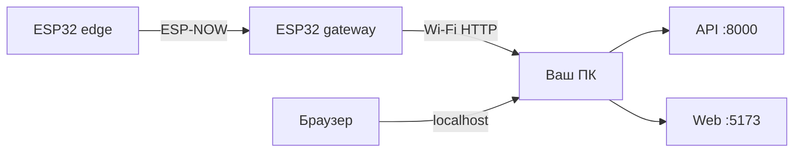

# Локальное тестирование связки BeePlan

Практичный сценарий для Windows, когда **ПК, концентратор и edge-устройство находятся в одной Wi‑Fi сети**.

## Рекомендуемый путь: веб-прошивка

Основной способ установки — мастер в **beeplan-web** (Chrome/Edge, USB):

1. Поднимите API, builder и веб (см. ниже).
2. Откройте http://localhost:5173 → **Прошивка**.
3. **Концентратор:** `/install/gateway` — Wi‑Fi, сборка на `beeplan-builder`, прошивка через WebSerial, автоматический heartbeat (MAC в API).
4. **Улей:** `/install/edge` — регистрация устройства, сборка с `GATEWAY_MAC` из API, прошивка.

Ручное редактирование `config.h` и `pio upload` — для разработчиков прошивки (см. [HARDWARE.md](HARDWARE.md)).

## Общая схема



- **Edge → Gateway** — ESP-NOW (Wi‑Fi AP не нужен, только MAC концентратора).
- **Gateway → API** — HTTP на **LAN‑IP вашего ПК** (не `localhost` — для ESP32 это сам шлюз).
- **Браузер → Web/API** — можно `localhost`, потому что браузер на том же ПК.

## Что понадобится

| Компонент | Количество |
|-----------|------------|
| ESP32 (edge) | 1 |
| ESP32 (gateway) | 1 |
| USB‑кабели | 2 (или по очереди) |
| ПК с Docker Desktop (или свой PostgreSQL) | 1 |
| [PlatformIO](https://platformio.org/) | — |
| Python 3.9+ | для миграций и seed |
| Node.js | для веба |
| Chrome или Edge | WebSerial для веб-прошивки |

Для веб-прошивки **PlatformIO на ПК не обязателен** — сборка выполняется в **beeplan-builder** (Docker).

---

## Шаг 1. Поднять API и БД на ПК

### Вариант A — скрипт (удобно на Windows)

```powershell
cd beeplan-api
.\scripts\start-local.ps1
```

Скрипт поднимет PostgreSQL в Docker на порту **5433**, выполнит миграции, `seed_dev` и запустит API на `http://0.0.0.0:8000`.

### Вариант B — API + builder + PostgreSQL в Docker

```powershell
cd beeplan-api
docker compose up --build
```

Поднимает PostgreSQL, **beeplan-builder** (:9000) и API (:8000). Затем миграции и seed на хосте (см. [README beeplan-api](https://github.com/4sidora/beeplan-api/blob/main/README.md)).

### Вариант C — всё в Docker (legacy)

Затем в другом терминале — миграции и seed (см. [README beeplan-api](https://github.com/4sidora/beeplan-api/blob/main/README.md)).

### После первого seed_dev

Сохраните вывод:

```
User: dev@example.com / devpassword
Authorization: Bearer <uuid>   ← INGEST_TOKEN для gateway
Edge device public_id: dev-edge-1
```

Если seed уже был и токен не показался — достаньте из БД:

```powershell
docker exec -it beeplan-api-db-1 psql -U beeplan -d beeplan -c "SELECT ingest_token FROM concentrators;"
```

(имя контейнера может отличаться — проверьте `docker ps`).

**Проверка:** http://localhost:8000/docs — должен открыться Swagger.

---

## Шаг 2. Запустить веб на ПК

```powershell
cd beeplan-web
copy .env.example .env
npm install
npm run dev
```

В `.env` для браузера на том же ПК:

```
VITE_API_URL=http://localhost:8000
VITE_DEVICE_API_URL=http://192.168.x.x:8000
```

`VITE_DEVICE_API_URL` — LAN-IP ПК для прошивки gateway (поле в мастере прошивки).

- Веб: http://localhost:5173
- Логин: `dev@example.com` / `devpassword`

---

## Шаг 3. Узнать LAN‑IP компьютера

```powershell
ipconfig
```

Нужен IPv4 Wi‑Fi адаптера, например `192.168.1.42`.

**Важно:** API должен слушать все интерфесы (`--host 0.0.0.0`) — в `start-local.ps1` это уже так. Если Windows Firewall спросит — разрешите входящие на порт **8000** для частной сети.

**Проверка с телефона в той же Wi‑Fi:** `http://192.168.1.42:8000/docs`.

---

## Ручная прошивка (разработчикам)

Если builder недоступен, используйте PlatformIO и `include/config.h.example` → `config.h`.

## Шаг 4. Прошить концентратор (gateway)

1. Отредактируйте `beeplan-gateway/include/config.h`:

```cpp
#define WIFI_SSID "ваша-wifi"
#define WIFI_PASSWORD "ваш-пароль"
#define API_BASE_URL "http://192.168.1.42:8000"   // LAN-IP ПК, без / в конце
#define INGEST_TOKEN "uuid-из-seed_dev"
```

2. Подключите ESP32 концентратора по USB и прошейте:

```powershell
cd beeplan-gateway
pio run -t upload
pio device monitor
```

3. В Serial должны появиться:
   - `BeePlan gateway`
   - IP концентратора в Wi‑Fi (например `192.168.1.50`)
   - позже: `POST /v1/telemetry/batch -> 200`

### MAC концентратора

После прошивки MAC выводится в Serial и регистрируется через heartbeat. При ручной прошивке также можно посмотреть в админке роутера.

MAC будет вида `AA:BB:CC:DD:EE:FF` — его нужно перевести в байты для edge:

```cpp
static const uint8_t GATEWAY_MAC[6] = {0xAA, 0xBB, 0xCC, 0xDD, 0xEE, 0xFF};
```

---

## Шаг 5. Прошить edge (улей)

1. Отредактируйте `beeplan-edge/include/config.h`:

```cpp
static const uint8_t GATEWAY_MAC[6] = {0xAA, 0xBB, 0xCC, 0xDD, 0xEE, 0xFF};
#define DEVICE_PUBLIC_ID "dev-edge-1"   // как в seed_dev
#define WAKE_INTERVAL_SEC 60
```

`DEVICE_PUBLIC_ID` **обязан совпадать** с записью в API, иначе batch вернёт `unknown device dev-edge-1`.

2. Прошивка:

```powershell
cd beeplan-edge
pio run -t upload
pio device monitor
```

В Serial edge: `BeePlan edge starting`, `ESP-NOW send status=0` (0 = успех).

---

## Шаг 6. Проверить цепочку end‑to‑end

| Где смотреть | Что ожидать |
|--------------|-------------|
| Serial **edge** | `ESP-NOW send status=0` каждые ~60 с (2 пакета: temp + RH) |
| Serial **gateway** | `POST /v1/telemetry/batch -> 200` не реже чем раз в ~30 с |
| http://localhost:8000/docs | можно руками дернуть `GET /v1/colonies/{id}/telemetry` |
| http://localhost:5173 | войти → «Демо-пасека» → семья → график `temperature_c` |

**Тайминг:** gateway шлёт батч, когда накопилось ≥8 сэмплов **или** прошло >30 с с хотя бы одним сэмплом. При интервале edge 60 с первая отправка — через ~30–60 с после старта edge.

---

## Связь «концентратор ↔ веб на ПК»

| Кто | Куда ходит | URL |
|-----|------------|-----|
| **Gateway (ESP32)** | API на ПК | `http://<LAN-IP-ПК>:8000` |
| **Браузер** | API | `http://localhost:8000` (через `VITE_API_URL`) |
| **Edge (ESP32)** | Gateway | MAC в `GATEWAY_MAC`, Wi‑Fi AP не нужен |

Ключевой момент: **`localhost` на gateway = сам gateway**, поэтому в `API_BASE_URL` только IP компьютера в локальной сети.

Веб **не общается с ESP32 напрямую** — только через API. Концентратор — единственный, кто шлёт телеметрию в API.

---

## Частые проблемы

### `POST ... -> -1` или connection failed на gateway

- Неверный `API_BASE_URL` (опечатка IP).
- Firewall Windows блокирует 8000.
- API не запущен или слушает только `127.0.0.1`.

### HTTP 401 на gateway

- Неверный `INGEST_TOKEN` — сверьте с БД / выводом `seed_dev`.

### HTTP 200, но `skipped: 1`, `unknown device`

- `DEVICE_PUBLIC_ID` на edge ≠ `dev-edge-1` в БД.

### ESP-NOW `send status != 0`

- Неверный `GATEWAY_MAC`.
- Устройства далеко — для теста держите рядом (1–2 м).
- Gateway не включён / не прошит.

### Данные в API есть, в вебе пусто

- Выбрана не та пасека/семья (нужна та, к которой привязан `dev-edge-1` в seed).
- Обновите страницу; метрика по умолчанию — `temperature_c`.

### Edge шлёт 2 пакета подряд, gateway может потерять один

Известное ограничение MVP (один слот `g_last`). Для отладки смотрите хотя бы температуру; оба значения могут не всегда доходить.

---

## Минимальный чеклист

1. `beeplan-api` → API на `:8000`, `seed_dev`, сохранить `ingest_token`.
2. `beeplan-web` → `npm run dev`, проверить вход.
3. Узнать LAN‑IP ПК (`ipconfig`).
4. Прошить **gateway** → узнать MAC → прописать в edge.
5. Прошить **edge**.
6. Serial gateway: `POST -> 200`.
7. Веб: график телеметрии.

---

## Без двух ESP32 (только софт)

```powershell
cd beeplan-api
py -3 -m beeplan.seed_demo_data
```

Появятся 2 недели демо‑телеметрии для графиков. Железную связку ESP-NOW это не проверит.

---

## PlatformIO на Windows

- Драйвер USB: **CP210x** или **CH340** (зависит от платы).
- Если порт не находится: `pio device list`.
- Явный порт: `pio run -t upload --upload-port COM3`.
- Два ESP32: прошивайте по одному, меняя USB.

---

## См. также

- [HARDWARE.md](HARDWARE.md) — сборка и настройка `config.h`
- [ARCHITECTURE.md](ARCHITECTURE.md) — поток данных
- [README beeplan-api](https://github.com/4sidora/beeplan-api/blob/main/README.md) — API и seed
- [README beeplan-gateway](https://github.com/4sidora/beeplan-gateway/blob/main/README.md) — прошивка концентратора
- [README beeplan-edge](https://github.com/4sidora/beeplan-edge/blob/main/README.md) — прошивка edge
